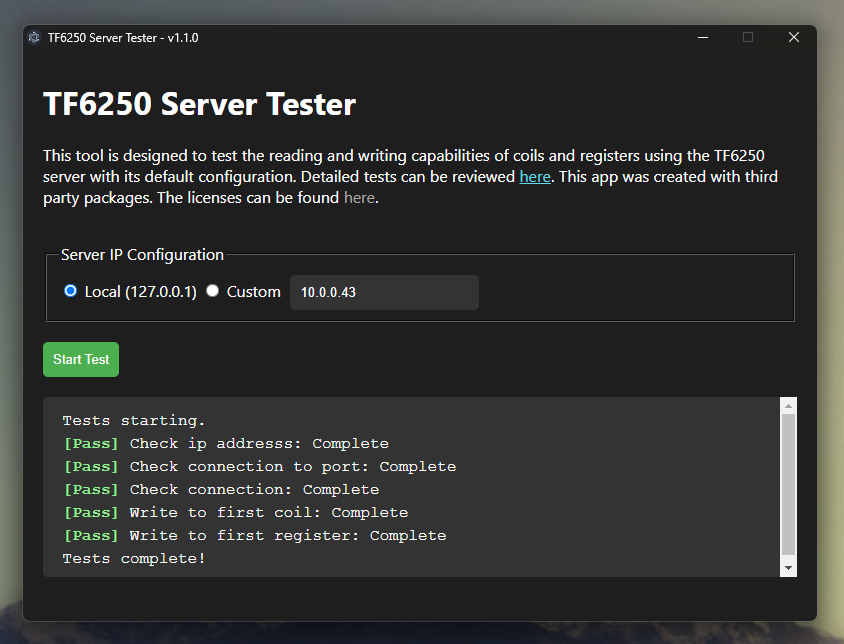

# TF6250 Server Test

## Description

This application is designed to test the basic functionality of the Beckhoff TF6250 Modbus Server using default configurations. It provides the flexibility to choose between a local server (`127.0.0.1`) or to input a specific IP address. Users can also select which tests to run, with all tests running by default.

## Screenshot



## Getting Started using installer

Download and run the TF6250 Server Tester Setup x.x.x.exe found in the releases.

## Getting Started using Node

These steps are only required if you wish to build, run and deploy your own version of the tool.  The pre-build version of the tool can be found in the releases folder. 

### Prerequisites

- Node.js (latest stable version)
- npm (comes with Node.js)

### Installation

#### Building from Source

1. Clone the repository:

   ```bash
   git clone https://github.com/benhar-dev/electron-tf6250-server-test.git
   ```

2. Navigate to the cloned directory:

   ```bash
   cd electron-tf6250-server-test
   ```

3. Install the dependencies:
   ```bash
   npm install
   ```

### Usage

To start the application, run the following command in the project directory:

```bash
npm start
```

### Building for Production

To build the application for production, use the following commands:

```bash
npm run dist
```

This will create a distribution using electron-builder and will generate necessary licenses and notices as part of the build process.
